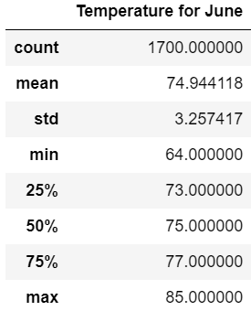
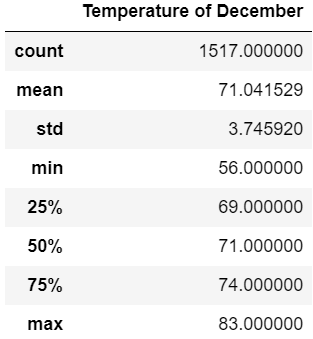
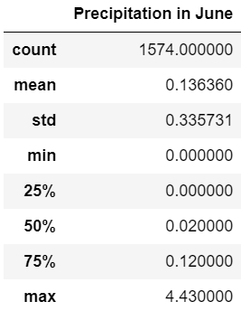
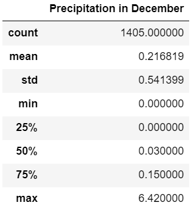

# surfs_up
SQLite, SQLAlchemy and Python

## Overview of the analysis
The analysis is conducted by pulling data from the SQLite database and then processing with Python and SQLAlchemy. The results illustrate the temperature difference between the months of June and December in Oahu, which is used to determine if the surf and ice cream shop business will be sustainable year-round or not.  

## Results
- For temperature records in December, there are 1517 data points in total. For temperature records in June, there are 1700 data points in total.  
- The average temperature in December is around 71 F. The average temperature in June is around 75 F.  
- The maximum temperature in December is around 83 F. The average temperature in June is around 85 F.  
  

## Summary
- From the analysis, it can be noticed that the temperatures in December and June are quite similar and comfortable to people. Therefore, a surf and ice cream business can be sustainable year-round. 
- Query 1: A query can be executed to pull the data about the precipitation situation in June and December.  
- Query 2: A query can be executed to list both temperature and precipitation together to have a more in-depth understanding of weather conditions in the two months.  
  

